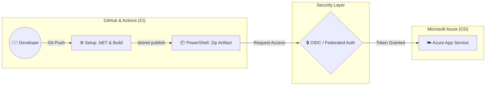

# azure-cicd-pipeline-architecture
Automated CI/CD pipeline architecture for ASP.NET Core deployment to Azure Web App using GitHub Actions, PowerShell, and OIDC passwordless authentication.


# ☁️ Automated CI/CD Pipeline for Enterprise Web App (Azure)

Repositori ini berisi dokumentasi arsitektur dan konfigurasi *Continuous Integration / Continuous Deployment* (CI/CD) menggunakan **GitHub Actions** untuk merilis aplikasi **ASP.NET Core** ke **Microsoft Azure App Service**. 

Proyek ini merupakan studi kasus dari penyelesaian masalah infrastruktur di tingkat *enterprise*, dengan fokus pada **keamanan autentikasi tanpa kata sandi (Passwordless OIDC)** dan **resolusi kegagalan rilis (Error 500)** melalui manipulasi artefak.

---

## 🏗️ Architecture Overview



*(Catatan untuk Tian: Buat bagan alir sederhana di draw.io, simpan sebagai gambar, lalu ganti tautan di bawah ini dengan gambar Anda)*


**Tech Stack:**
- **Cloud Provider:** Microsoft Azure (App Service)
- **CI/CD Orchestration:** GitHub Actions
- **Identity & Security:** Microsoft Entra ID (OIDC / Federated Credentials)
- **Scripting:** PowerShell
- **Framework:** ASP.NET Core (.NET 10.x)

---

## 🔥 Key Challenges & Technical Solutions

Proyek ini dirancang untuk memecahkan dua masalah kritikal yang sering terjadi pada *deployment* skala besar:

### 1. Zero-Trust Security dengan OIDC (Passwordless)
**Masalah:** Menyimpan kredensial rahasia (*Client Secret*) secara statis di GitHub Secrets rentan terhadap kebocoran dan menyalahi prinsip keamanan *Zero-Trust*.
**Solusi:** Mengimplementasikan **OpenID Connect (OIDC)**. GitHub Actions dikonfigurasi untuk meminta token akses sementara langsung dari Azure (melalui *User-Assigned Managed Identity*). Autentikasi dikunci secara ketat berdasarkan nama *branch* spesifik (misal: `merge-fix-vava`), sehingga infrastruktur terhindar dari intervensi *branch* yang tidak sah (mengatasi masalah `Error AADSTS700213`).

### 2. Mengatasi "Azure OneDeploy Error 500" via PowerShell
**Masalah:** Saat proses *publish*, *Azure App Service* mengembalikan status `Internal Server Error (CODE: 500)`. Analisis *log* menunjukkan bahwa *runner* GitHub secara default menyimpan artefak ke direktori sistem (`DOTNET_ROOT`), dan Azure OneDeploy gagal mengekstrak struktur folder mentah tersebut.
**Solusi:** Merestrukturisasi jalur *output* ke *workspace* repositori (`github.workspace`) dan menginjeksi skrip **PowerShell** `Compress-Archive` langsung di dalam *pipeline*. Artefak dibungkus secara paksa menjadi sebuah file `.zip` tunggal sebelum dikirim, memastikan integritas struktur *file* terjaga 100% saat diekstrak oleh server Azure.

---

## ⚙️ Pipeline Workflow Breakdown

Alur kerja (`.github/workflows/deploy.yml`) dibagi menjadi dua *jobs* utama:

### Job 1: Build
1. **Checkout Code:** Mengambil versi kode terbaru dari *branch* yang disepakati.
2. **Setup .NET:** Menginisialisasi *environment* .NET Core 10.x.
3. **Build & Publish:** Mengompilasi kode sumber (Release mode) dan mengarahkannya ke `github.workspace`.
4. **Zipping (PowerShell):** Membungkus folder *publish* menjadi `myapp.zip`.
5. **Upload Artifact:** Menyimpan paket `.zip` ke penyimpanan sementara GitHub.

### Job 2: Deploy
1. **Download Artifact:** Mengunduh paket `.zip` dari tahap Build.
2. **Login to Azure:** Membuka gerbang ke portal Azure menggunakan *OIDC Federated Credentials*.
3. **WebApps Deploy:** Mengirim paket `.zip` menggunakan aksi `azure/webapps-deploy@v3` ke *slot* produksi (SINTA).

---

## 🔒 Sanitized Configuration (Snippet)

Berikut adalah potongan konfigurasi perbaikan artefak (Zipping) yang menjadi kunci penyelesaian *Error 500*:

```yaml
      - name: dotnet publish
        run: dotnet publish sinta-asp.csproj -c Release -o "${{ github.workspace }}\myapp"

      - name: Create deploy package (zip)
        run: |
          powershell -Command "Compress-Archive -Path '${{ github.workspace }}\myapp\*' -DestinationPath '${{ github.workspace }}\myapp.zip' -Force"

      - name: Upload artifact for deployment job
        uses: actions/upload-artifact@v4
        with:
          name: dotnet-app
          path: ${{ github.workspace }}/myapp.zip
